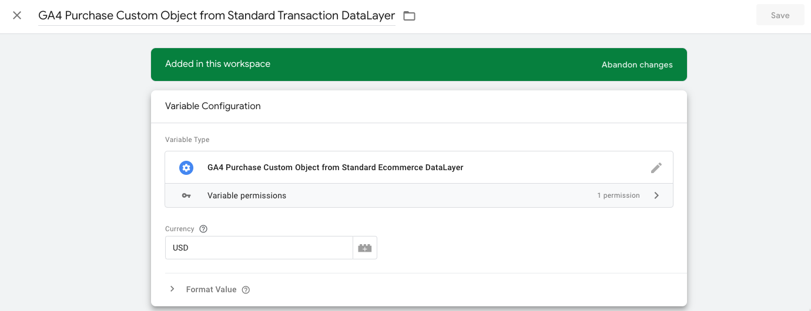

# GTM Variable Template - GA4 Purchase Custom Object from Standard Ecommerce DataLayer

This template variable would convert the classic/standard e-commerce transaction data layer into a Custom Object that can be used in the GA4 event tag to send the purchase event.

## How to use?

### Creating the variable

1. Once the template is downloaded from the Gallery (or imported using this repository), go to `Variables` > `New` > `GA4 Purchase Custom Object from Standard Ecommerce DataLayer`
2. Enter the Currency code manually or reference it to a variable (currency is a required parameter in GA4)
3. Give a name to the variable & Save

### GA4 Event Tag

1. Open the GA4 purchase event tag & go to `More Settings`
2. Check `Send Ecommerce data` 6. Select `Custom Object` from the **Data Source** drop down
3. Select the variable that created in step 3 from the **Ecommerce Object** drop down
